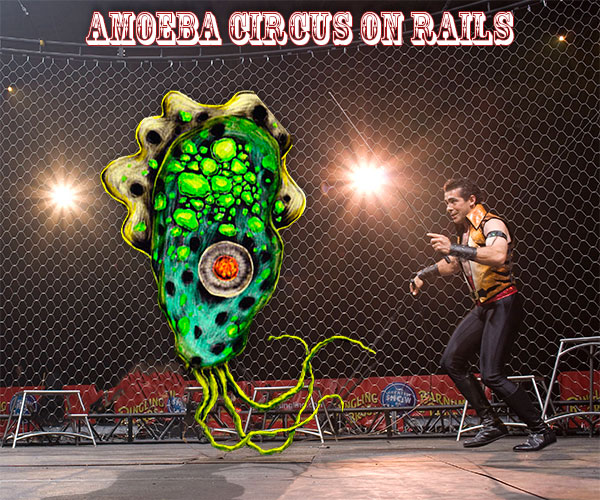

# Amoeba Circus on Rails

## Goal

Typhus, the ringmaster needs an application that will allow him to schedule his acts for his upcoming amoeba circus. 

First he will need to be able to input all his Amoeba performers into a list keeping track of their name, special talent: acrobat, contortionist, clown, juggler, or freak; and their generation number based on the number of splits that occured up to their creation. Each time an amoeba splits the old amoeba dissapears and two new amoebas are created sharing the special talent of their parent. So for example: if Brian a juggler is first generation amoeba and then splits, he is destoyed as 2 new amoebas jeff and barry are created both jugglers with their generation number set to 2.

We will also need to create acts that amoebas can be added to. Acts will have a name, date and time of performance and a list of all the amoebas performing for that act.

## Instructions

1. generate a new rails app
2. cd into app and initialize as a new git repo.
3. add a remote matching the same name on your personal github.
4. using rails generate commands, create the models and migrations needed for amoebas, acts, and talents.
acts and amoebas will have models, controllers, and views, whereas talent only needs a model to store the name of each special talent: acrobat, contortionist, clown, juggler, or freak;
5. Check the migrations to make sure they are correct and make any changes neccesary.
6. Fill in the appropriate active record associations for each model and then run the migrations.
7. Fill in the /db/seeds.rb to build some acts, special talents, and amoebas.
8. Then run rake db:seed to populate your development db.
9. make sure to include the following RESTful views:
 - display all amoebas (link name to show that amoeba)
 - show an individual amoeba (include a link to split amoeba using custom routes)
 - edit an individual amoeba so that it can be added to an act.
 - display all acts
 - show an indivdual act (that displays its date and all the amoba actors asiigned to it)
 - edit an individual act
 - bonus view: a single dashboard view that shows all acts, all amoebas, and a form to move amoebas
10. When completed copy and paste link to your github repos master branch to this post on Piazza.
